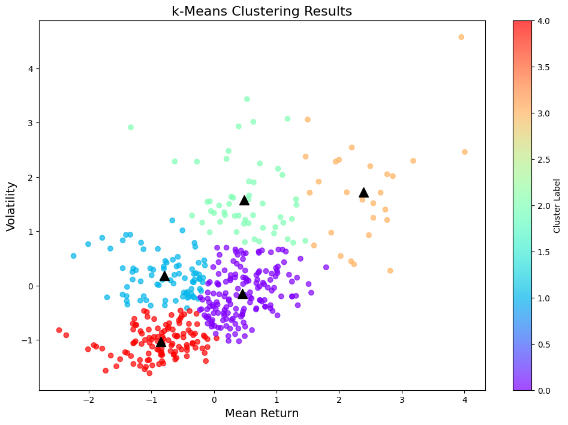

# Pair Trading Strategy

## Introduction

This repository contains a Python-based implementation of a pair trading strategy. The strategy identifies and trades pairs of stocks from the S&P 500, leveraging statistical methods to exploit price discrepancies. The project uses historical data of stock prices to calculate mean return and volatility, employs a k-means clustering algorithm to group similar stocks into clusters, performs cointegration tests, and calculates key statistics like half-life of mean reversion etc. to select promising pairs.

## Project Structure

- **Data Collection**: 

    Historical close prices of S&P 500 stocks are downloaded using the `yfinance` library. We choose the price data from `2009-01-01` to `2017-12-31` for clustering algorithms, `2018-01-01` to `2021-12-31` for applying the criteria for searching promising pairs and `2022-01-01` to `2023-12-31` for final testing data of the strategy.

- **Feature Engineering**: Mean return and volatility are computed for each stock as features for clustering. Columns with more than 10% missing values are removed and other missing values are filled by both forward and backward filling. The return and volatility data are standardized before applying k-means.
  
- **Clustering**: k-means clustering is utilized to group the stocks into 5 clusters based on the computed features.

- **Pair Selection Criteria**: Pairs are selected within clusters based on their **cointegration**, **half-life**, and the frequency of the spread series crossing the mean. The selection criteria are as follows:

1. **Statistical Significance**:  
   - The t-stat from the Engle-Granger test must be statistically significant at the **5% level**.

2. **Half-Life of Mean Reversion**:  
   - The half-life of the spread must satisfy the condition:  
     **1 < Half-life < 252**.

3. **Spread Crossing the Mean**:  
   - On average, the spread must cross the mean **at least 12 times per year**.

-**Strategy Implementation**: The trading strategy is implemented on the potential stock pairs identified during the pair selection process. The strategy involves calculating the spread between the two stocks in a pair, standardizing it using a z-score, and generating trading signals based on threshold levels.

1. **Input Data**:  
   - For each potential pair `(S1, S2)`, the historical price data (`test_data`) for both stocks is used to compute the spread.

2. **Linear Regression to Model the Spread**:  
   - An Ordinary Least Squares (OLS) regression is performed with `S2` as the dependent variable and `S1` as the independent variable.  
   - The spread is calculated as the difference between `S2` and the predicted values of `S2` based on the regression model.

3. **Rolling Statistics for Z-Score Calculation**:  
   - A rolling window is applied to compute the mean and standard deviation of the spread over a window size of 10 days.  
   - The z-score is calculated as:  
     **z-score = (spread - rolling_mean) / rolling_std**  
   - Initial days with insufficient data to compute the rolling statistics are excluded.

4. **Thresholds for Entry and Exit Signals**:  
   - **Entry Threshold**: A z-score of ±2.0 is used as the threshold to initiate trades.  
     - **Long Position**: When z-score < -2.0, go long on `S1` and short on `S2`.  
     - **Short Position**: When z-score > 2.0, go short on `S1` and long on `S2`.  
   - **Exit Threshold**: Close all positions when the absolute z-score falls below 1.0.  
   - Positions are maintained if the z-score lies between -2.0 and -1.0 or between 1.0 and 2.0.

5. **Daily Position Updates**:  
   - The daily positions for `S1` and `S2` are updated based on the trading signals generated by the z-score thresholds.

6. **Return Calculation**:  
   - Daily returns for each stock are computed as the percentage change in prices, adjusted for the respective positions held.  
   - The total daily returns for the strategy are the sum of the returns from both stocks in the pair.
     
- **Performance Metrics**: The strategy's performance is evaluated using the Sharpe Ratio and Maximum Drawdown.
   - **Cumulative Returns**: The cumulative product of (1 + total daily returns) gives the cumulative returns of the strategy.  
   - **Sharpe Ratio**:  
     - The average daily return and standard deviation of daily returns are annualized.  
     - The Sharpe ratio is calculated as:  
       **Sharpe Ratio = Average Annual Return / Annualized Standard Deviation**
       
## Preliminary Results

The implemented trading strategy was evaluated using historical data. In particular, the best stock pairs we currently find out is `('CAH', 'DUK')` with a Sharpe ratio ~2.09, without considering the transaction cost etc. yet. 

## Future Work

This project is ongoing, and several improvements are planned to enhance its robustness and accuracy. Here are the specific areas that can be addressed:

- **Expansion of Financial Indicators**: Currently, we utilize only annual return and volatility as primary indicators for stock performance and volatility. To better model complex market dynamics, we plan to incorporate additional financial metrics. Possible indicators include: **Beta**, **Moving Averages**, **Relative Strength Index (RSI)** and **MACD (Moving Average Convergence Divergence)** etc.

- **Advanced Clustering Techniques**: The simple k-means clustering algorithm currently used will be compared against more sophisticated and state-of-the-art clustering methods, such as: **DBSCAN (Density-Based Spatial Clustering of Applications with Noise)**, **Hierarchical Clustering** etc.

- **Optimization of Strategy Parameters**: The trading strategy parameters, particularly the entry and exit thresholds, have not been optimized. We plan to employ Bayesian optimization to fine-tune these parameters, aiming to maximize the strategy's performance.

- **Incorporation of Machine Learning Models**: To further improve the trading signals, we are considering the use of machine learning algorithms(such as DNN) for more accurate spread predictions.

- **Trade Across Multiple Pairs**: Currently, our trading strategy is limited to each pair separately. To diversify risk and potentially enhance returns, we can expand our strategy to include a portfolio of various promising pairs.

- **Transaction Cost**: We did not consider transaction cost etc. in this project and they should be addressed for more realistic situation. 

